# Expense Tracker — Finance Manager

A clean, modern fintech-style iOS expense tracker built with SwiftUI and Core Data. Track your income and expenses, visualise spending by category, and generate monthly CSV reports — all stored locally on device.

- Although React Native is preferred, I have developed my app using SwiftUI because it is faster and efficient options for **iOS development**.
- Would love to considered for this position. Thank You :)
- Theme Color and Glass Look on transaction row is inspired from TUF+ Dashboard.

---

## Screenshots

<p align="center">
  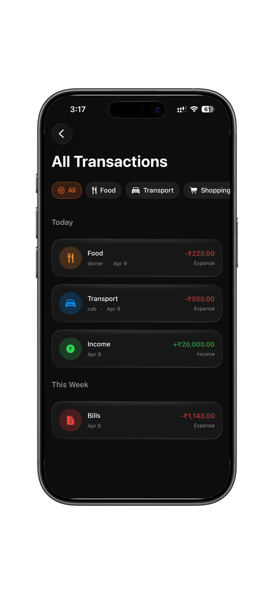
  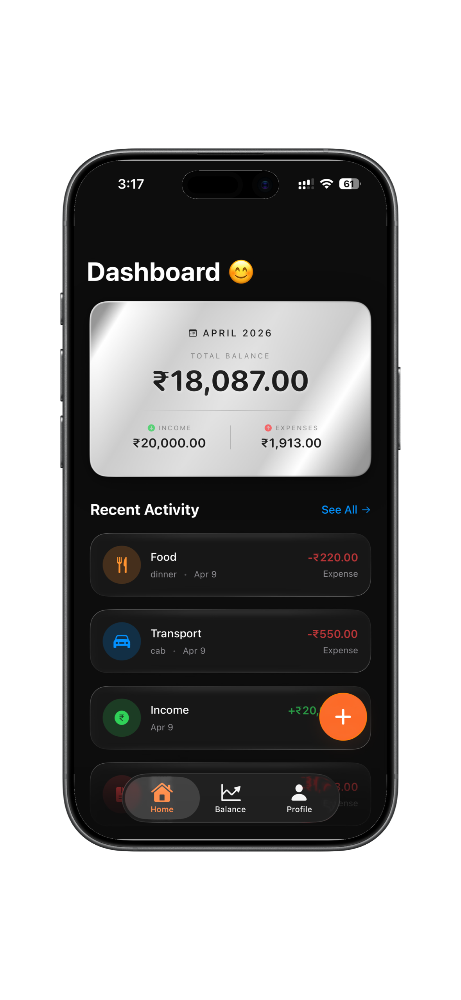
  
  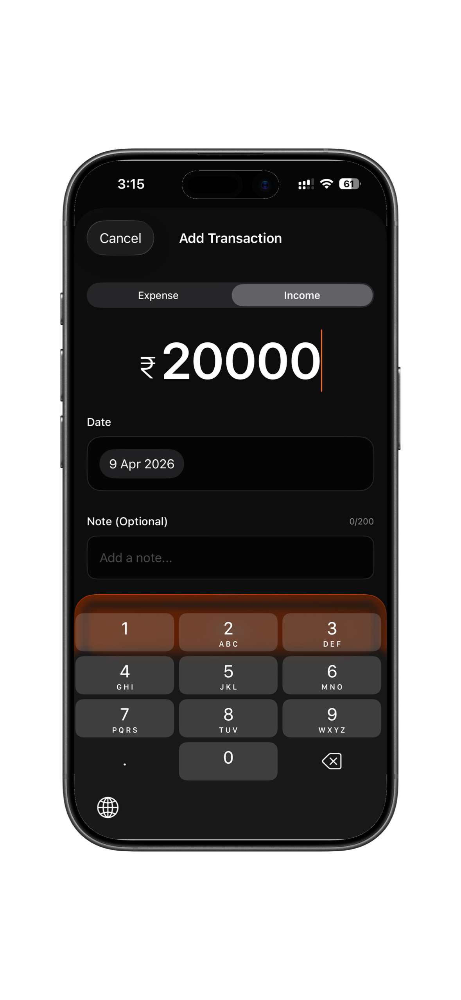
  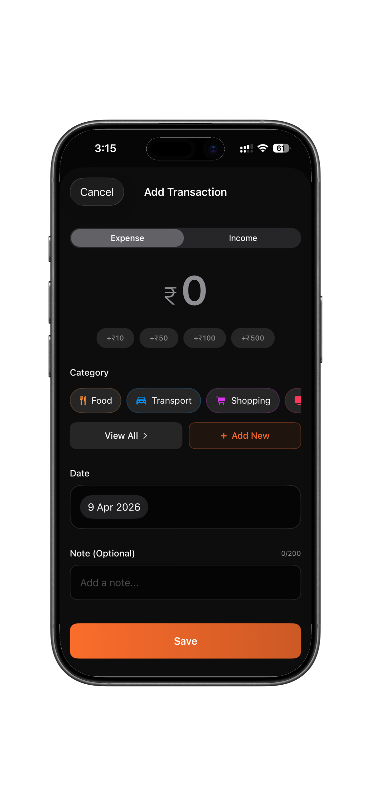
</p>

<p align="center">
  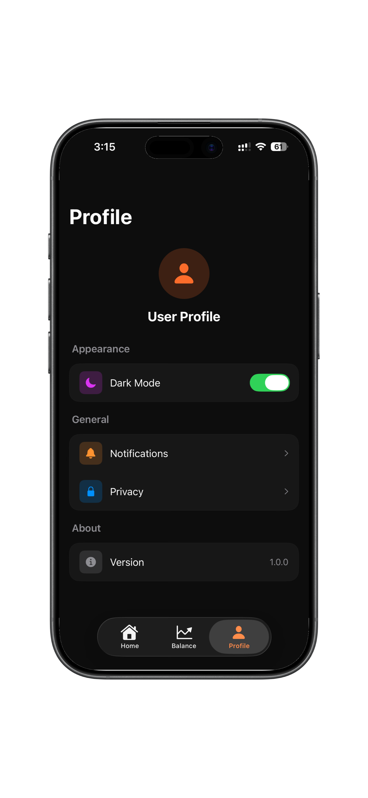
  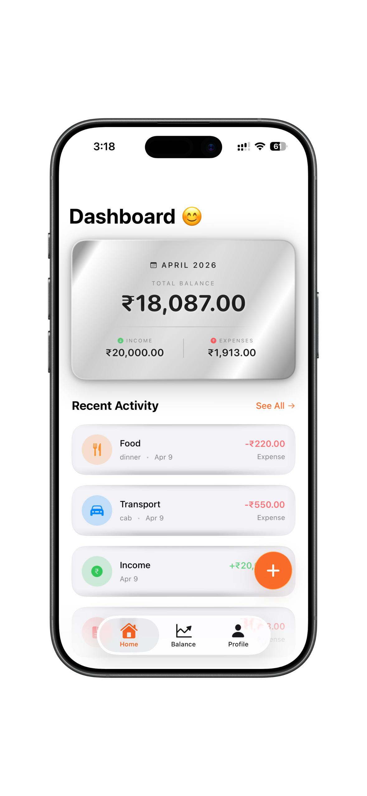
  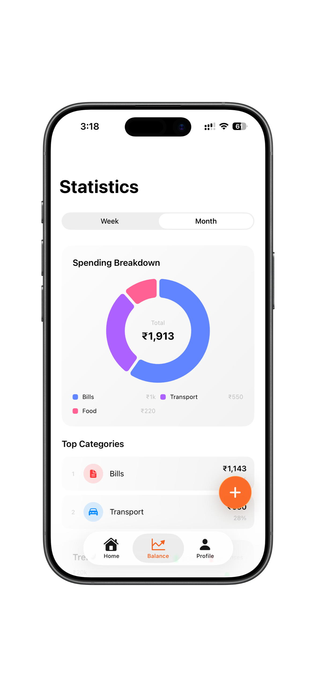
  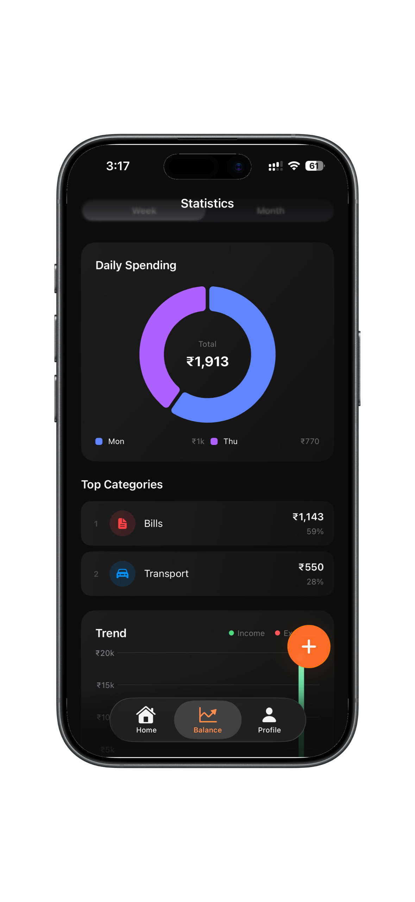
  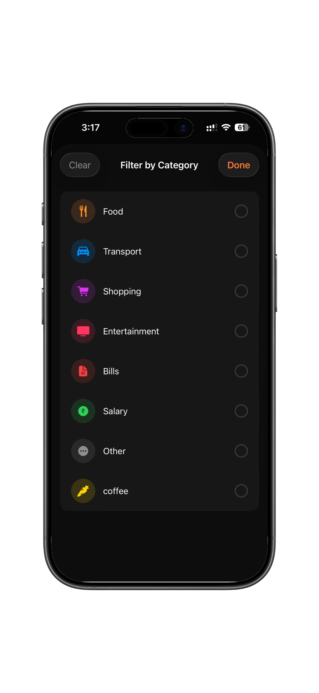
</p>

<p align="center">
  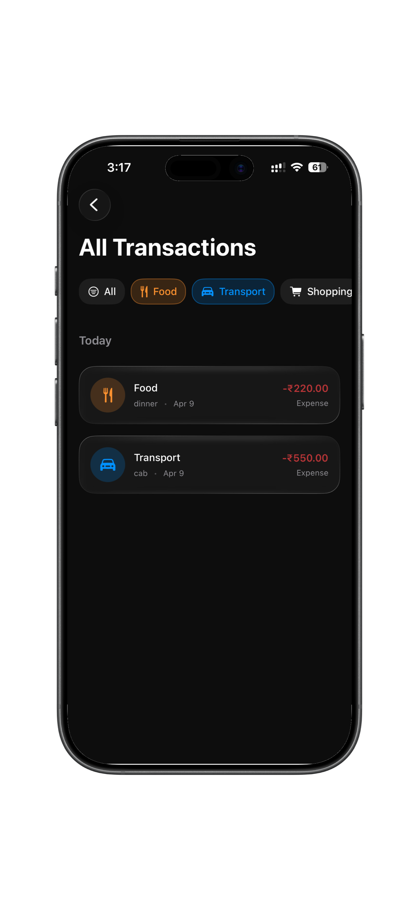
  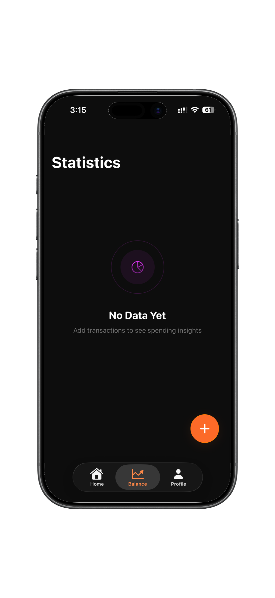
  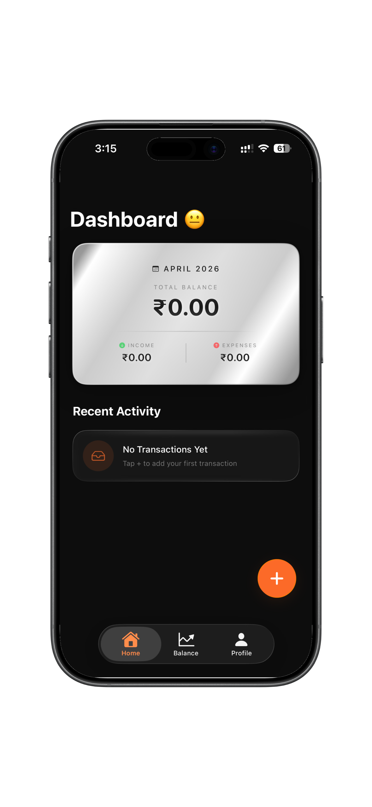
  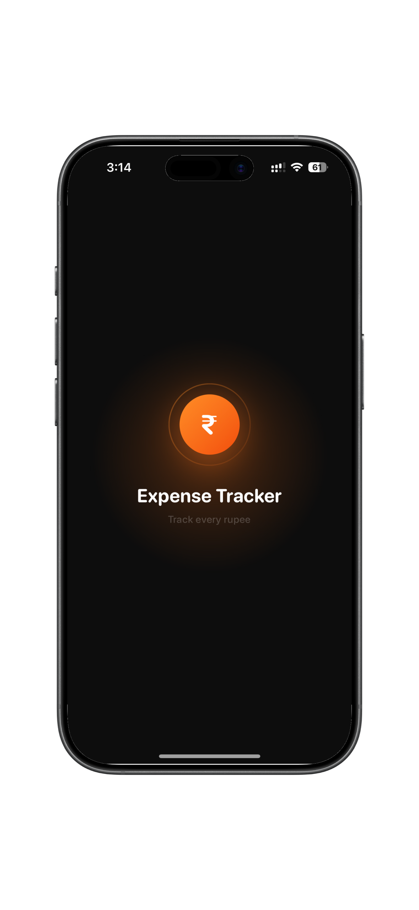
  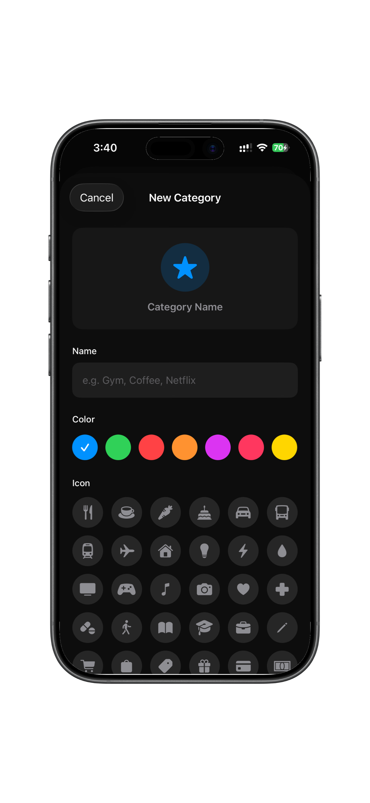
</p>


---

## Features

### Core

- **Add Income & Expenses** — UPI-style large amount input with transaction type toggle (swipe or tap)
- **Category Tracking** — 7 predefined categories (Food, Transport, Shopping, Entertainment, Bills, Salary, Other) plus unlimited custom categories with custom icons and colors
- **Monthly Summary** — Total income, total expenses, and net balance displayed on the home screen balance card
- **Local Storage** — All data persisted on-device using Core Data, no backend or internet required

### Transactions

- Amount, category, date, and optional note fields
- Form validation with inline error messages
- Edit and delete existing transactions with swipe-to-delete
- Note character limit enforcement

### Categories

- Create custom categories with 32 SF Symbol icons and 8 color options
- Live preview card while creating a category
- Full category browser with search in the Add/Edit transaction flow

### Statistics (Balance Tab)

- **Spending Breakdown** — Animated donut chart grouped by category (monthly) or by day (weekly)
- **Top Categories** — Ranked list of highest-spend categories with percentage share
- **Trend Chart** — 6-month income vs expenses bar chart
- **Generate Report** — Export current month's transactions as a CSV file via share sheet (Mail, Files, AirDrop, etc.)
- Swipe left/right to switch between Week and Month views

### All Transactions

- Full transaction history with date grouping
- Multi-select category filter — tap up to 4 quick chips or open the full filter sheet
- Empty state illustrations

### UI / UX

- **Dark & Light mode** toggle from the Profile tab, persists across launches
- Gradient cards throughout (balance card, stat cards, buttons)
- Haptic feedback on all key interactions
- Keyboard dismisses on tap anywhere outside input
- Toast notifications for save / delete confirmations positioned just above the tab bar
- Smooth spring animations and micro-interactions on every screen
- Swipe gestures on Stats view to switch periods

---

## Tech Stack

| Layer        | Technology             |
| ------------ | ---------------------- |
| Language     | Swift 5.10             |
| UI Framework | SwiftUI                |
| Charts       | Swift Charts (iOS 16+) |
| Persistence  | Core Data              |
| Architecture | MVVM                   |
| Minimum iOS  | iOS 16.0               |

---

## Setup Instructions

### Requirements

- macOS 13 (Ventura) or later
- Xcode 15 or later
- iPhone or Simulator running iOS 16.0+

### Steps

1. **Clone the repository**

   ```bash
   git clone https://github.com/silentstone00/swiftui-expenseTracker.git
   cd expense-tracker
   ```

2. **Open in Xcode**

   ```bash
   open expense_tracker.xcodeproj
   ```

   No Swift Package Manager dependencies — nothing to resolve.

3. **Select a target**
   - Choose your physical device or a simulator from the scheme picker (top bar in Xcode)
   - Minimum deployment target is iOS 16.0

4. **Set the development team** _(required for physical device only)_
   - Go to `expense_tracker` target → Signing & Capabilities
   - Select your Apple ID team under "Team"

5. **Build & Run**
   - Press `⌘ R` or click the play button
   - App launches with an empty state; tap **+** to add your first transaction

### First Launch

The app starts with no data. All predefined categories are available immediately — no setup required. Custom categories can be added from the Add Transaction screen.
